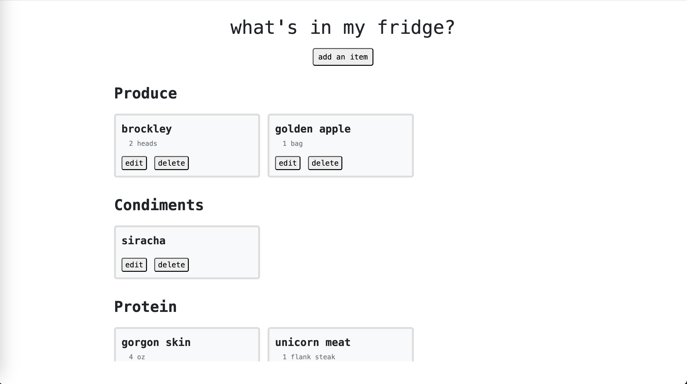
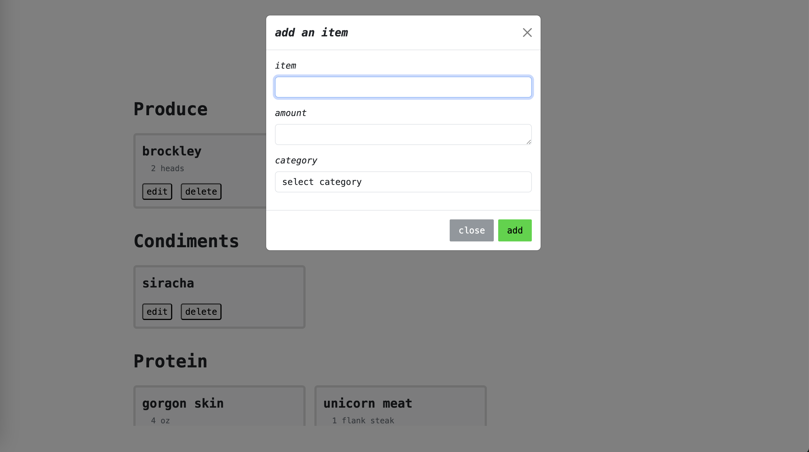
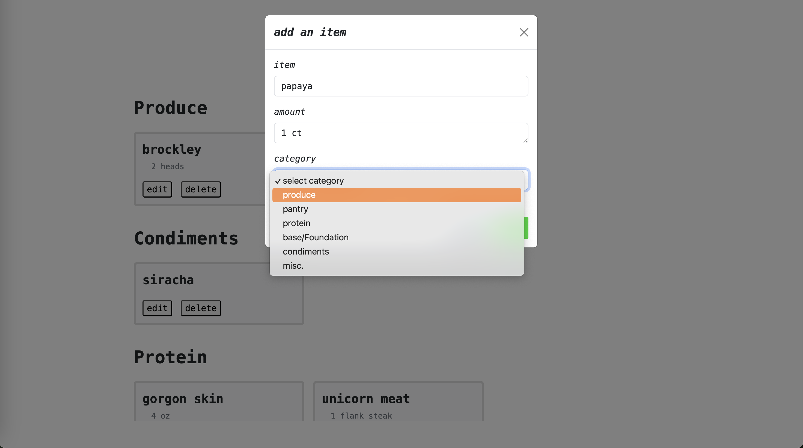
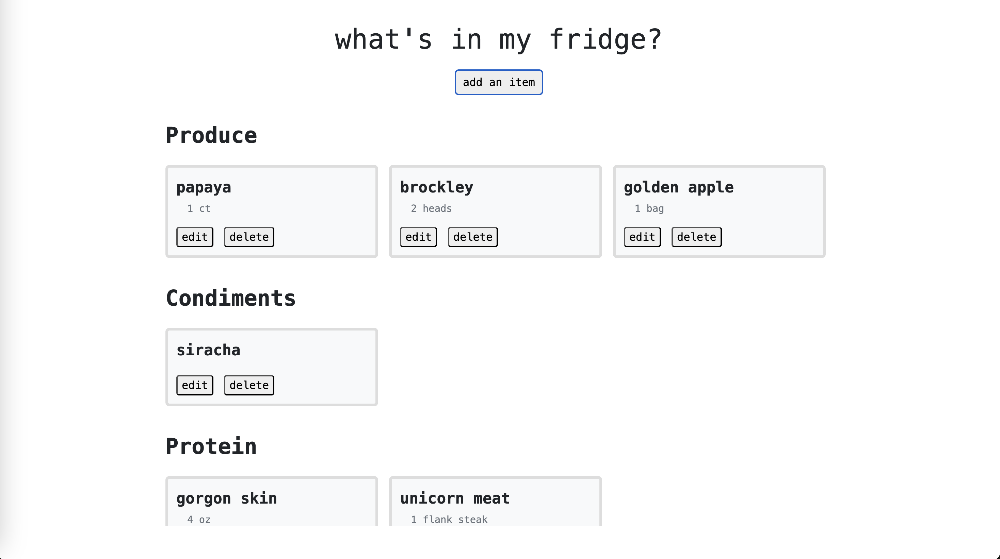
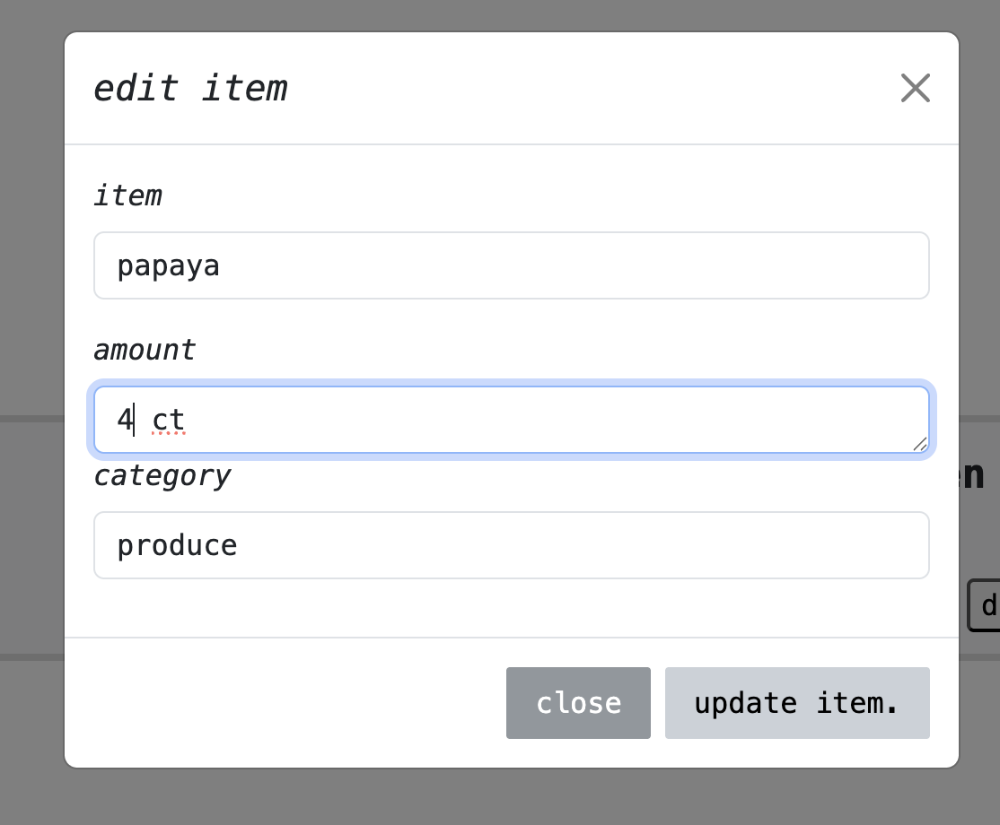
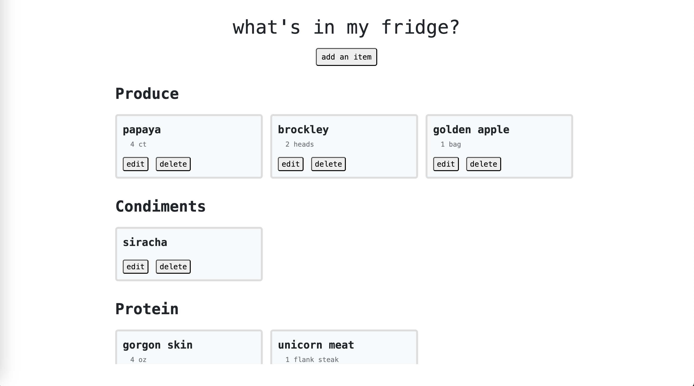
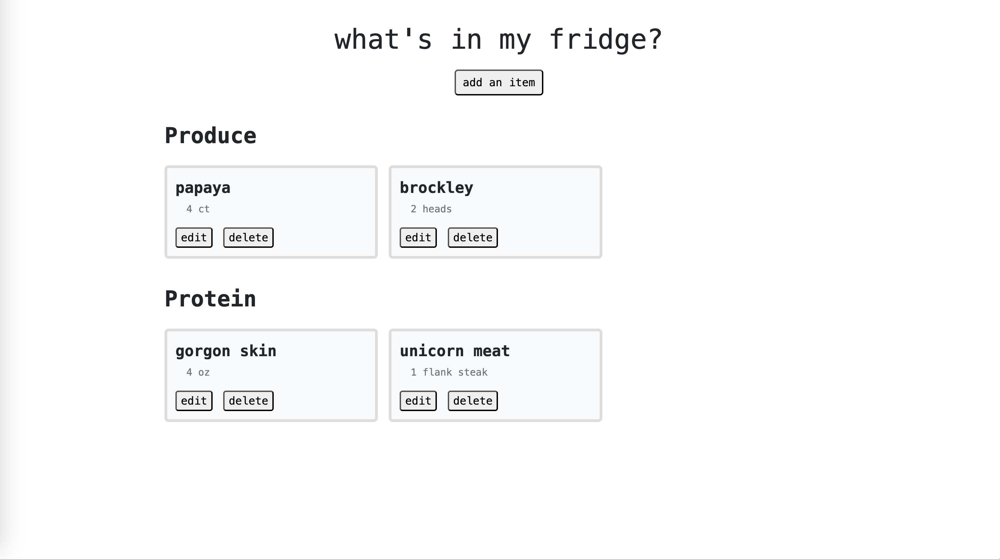

# cs3980todo app, My Fridge

```bash
python3 -m venv venv
source ../.venv/bin/activate  or  . venv/bin/activate
pip3 install fastapi
pip3 install uvicorn
pip3 install pydantic
uvicorn main:app --reload
```

Add, display, update, and remove the contents of my kitchen so I can visually track which ingredients I have.

Uses the foundational CRUD functionalities.

Built from the todo app base with FastAPI.

If I kept working on this project, I'd like to enhance the interface, suggest recipes that make use of ingredients I have, and have a user system to save and write data to for separate users.

```bash
pip3 freeze > requirements.txt
```

---
## Screenshots
**Main Page**



**Add an item**


**Add an item cont.**


**Item renders on the page**


**Edit item modal**


**Item is edited (papaya now has 4 ct, updated from 1 ct)**


**After deleting an item it is removed**

